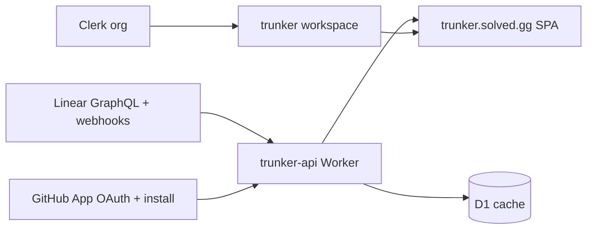

**trunker** is a multi-tenant cloud product that connects **Linear** (planning) and **GitHub** (code / PR targets) for a team workspace. It syncs teams, projects, and issues into a queryable cache, shows trunk branch names derived from Linear projects, and prepares org/repo access so you can open pull requests into the right GitHub destinations.

| | |
| --- | --- |
| App | [https://trunker.solved.gg](https://trunker.solved.gg) |
| API | [https://trunker.api.solved.gg](https://trunker.api.solved.gg) |
| Health | [https://trunker.api.solved.gg/health](https://trunker.api.solved.gg/health) |

## Why trunker exists

Issue trackers and git remotes are loosely coupled by convention. Agents and humans need:

1. A reliable map from **Linear project → trunk ref** and **issue → branch name**
2. A shared cache of planning state (not only the Linear UI)
3. A place to attach **which GitHub org/repos** a workspace opens PRs into

trunker is that control plane for the cloud MVP. Local git worktrees and a full CLI daemon are designed separately and are **not** required to use the hosted product today.

## What trunker does today

- **Clerk organizations as workspaces** — each org is one trunker workspace with its own connections and synced data
- **Linear OAuth** — connect a Linear account; tokens encrypted at rest
- **Sync** — GraphQL poll (Worker cron every 5 minutes) plus signed Linear webhooks
- **Dashboard** — connection health, last sync, team / project / issue counts
- **Projects & issues** — browse synced Linear entities and trunk metadata (`trunker/<branch_slug>`)
- **GitHub App linking** — OAuth user connect, App install/setup, list installations and repositories for PR targets
- **Settings** — optional team-key and project-id filters for sync scope

## What trunker is not (yet)

Honest early-access boundaries for the cloud MVP:

| Deferred | Notes |
| --- | --- |
| Local worktrees / `trunk work` | Specified for a future local daemon; not in the hosted UI |
| Automatic “open PR” from an issue | GitHub link + repo list land first; create-PR actions follow |
| Linear write-back (state, comments) | Read/sync oriented MVP |
| Arbitrary SQL query API for agents | Not exposed on the cloud Worker yet |
| Full multi-git-host support | GitHub App path only for now |

## Core model

| Concept | Meaning |
| --- | --- |
| **Workspace** | Clerk Organization id; isolation boundary for tokens and entities |
| **Trunk ref** | `trunker/<branch_slug>` for a Linear project |
| **Issue branch** | `trunker/<branch_slug>/<ISSUE-ID>` (for example `trunker/mobile/ENG-456`) |
| **Linear connection** | OAuth tokens + optional sync filters per workspace |
| **GitHub connection** | User OAuth token + optional App `installation_id` for org/repo access |

## Who should use this

- Teams that track work in **Linear** and ship on **GitHub**
- Operators who want a dark, org-scoped dashboard for sync health and trunk naming
- Engineers wiring agents or CI against a stable issue/project cache (via the HTTP API)

## Next steps

<CardGroup cols={2}>
  <Card title="Quickstart" icon="rocket" href="/trunker/0.1.0/quickstart">
    Sign in, create an org, connect Linear and GitHub.
  </Card>
  <Card title="Workspaces" icon="users" href="/trunker/0.1.0/concepts/workspaces">
    How Clerk Organizations map to trunker data.
  </Card>
  <Card title="Connect Linear" icon="link" href="/trunker/0.1.0/guides/connect-linear">
    OAuth, sync, and webhook expectations.
  </Card>
  <Card title="API reference" icon="code" href="/trunker/0.1.0/reference/api">
    Authenticated REST surface for status, issues, and connections.
  </Card>
</CardGroup>

## Product & contact

- App: [trunker.solved.gg](https://trunker.solved.gg)
- Org: [solved.gg](https://solved.gg)
- Legal: [Privacy](/legal/2026-07-04/privacy) · [Terms](/legal/2026-07-04/terms) · [EULA](/legal/2026-07-04/eula)
- Questions: [intake@solved.gg](mailto:intake@solved.gg)
